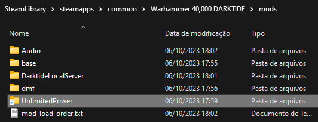
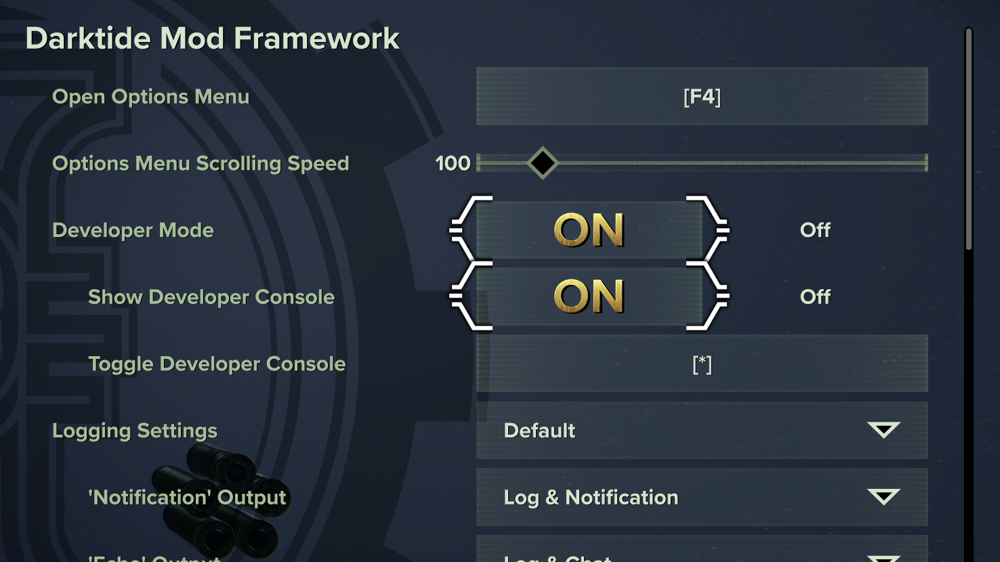

# Unlimited Power
## Description
This is a simple mod that plays various Palpatine related SFX when certain game actions happen. It's a bit of a meme mod, but I hope you enjoy it nonetheless.

## Features
### Audio
* Plays "Unlimited power" on Blitz Smite charge
* On force sword special activation, plays "It's treason then"
* When peril has reached 100 and you have your hands up, plays "No, no, no!"
* When peril has reached 100 and you blow up, plays "The attempt on my life..."

### UI
Mod options are available to set the volume, frequency of the audio and more.

## Localization
- [x] English
- [x] Pусский - Thanks to [@xsSplater](https://github.com/xsSplater)
- [ ] For others, please submit PR in [Github](https://github.com/JCalebBR/UnlimitedPower)

## Installation
1. Install dependencies:
    1. [Darktide Modding Framework](https://www.nexusmods.com/warhammer40kdarktide/mods/8)
    2. [Darktide Mod Loader](https://www.nexusmods.com/warhammer40kdarktide/mods/19)
    3. [Darktide Local Server](https://www.nexusmods.com/warhammer40kdarktide/mods/211)
    4. [Audio Plugin](https://www.nexusmods.com/warhammer40kdarktide/mods/196)
2. Download the latest version of the mod from the [releases page](https://github.com/JCalebBR/UnlimitedPower/releases/latest).
3. Extract the `UnlimitedPower` folder into your `mods` folder.

4. Place it in your load order. Should be as follows:
    * DarktideLocalServer
    * Audio
    * UnlimitedPower
5. ???
6. Profit

## Limitations
* You need Show Developer Console set to ON and Developer Mode set to ON in DMF settings as per screenshot below, otherwise you'll get a popup cmd window every time the audio file plays. Thanks to **raretrick** for reporting the issue and **SeventeenV** for the graphic.
* This is a limitation from Darktide Local Server, nothing I can do about it for now.

## Credits

* Thanks to DMF, DML and DLS devs for making this possible.
* Thanks to my ADHD for making me do this.
* I do not own the sound files used in this mod, they are from the Star Wars franchise.
